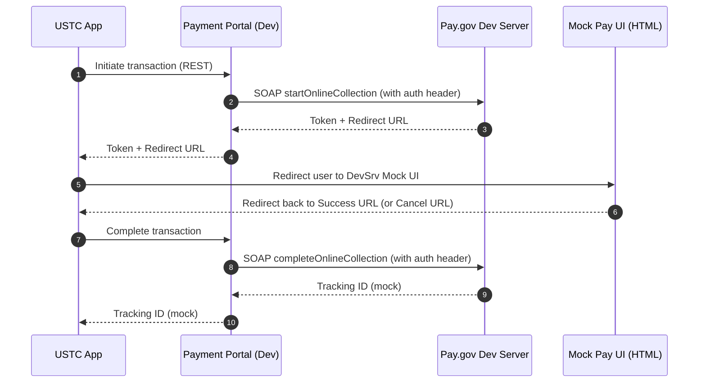
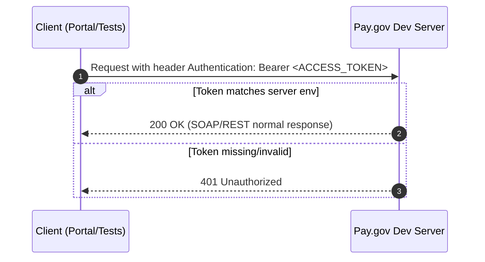

# USTC Pay.gov Dev Server — Architecture Overview

> **Purpose.** This document explains how the USTC Pay.gov Dev Server fits into the broader USTC payment flow, what components exist (SOAP, REST, mock UI, S3‑hosted artifacts), and how requests move through the system. It is a **mock of Pay.gov** used for development and integration testing only; it does **not** process real payments. 

---

## 1) Context & Goals

USTC applications that collect fees call the **USTC Payment Portal**. In **development**, the Portal targets this **Dev Server** instead of the real Pay.gov service. The Dev Server:
- Serves **WSDL/XSD** artifacts compatible with the Hosted Collection Pages service. 
- Exposes a **mock SOAP endpoint** implementing operations the Portal uses (e.g., `startOnlineCollection`, `completeOnlineCollection`). 
- Provides a minimal **HTML UI** for **Complete/Cancel** to emulate user interaction and redirect back to the originating app. 

For authoritative semantics of Pay.gov’s web services, see the **Pay.gov Web Services Technical Overview**. We align field names and behavior for developer realism, but this service is for **dev/test** only. 

**Related repositories**
- USTC Pay.gov Dev Server (this project): https://github.com/ustaxcourt/ustc-pay-gov-test-server 
- USTC Payment Portal (consumer of this server): https://github.com/ustaxcourt/ustc-payment-portal/ 

---

## 2) High‑Level Architecture

### 2.1 Components

- **Express/TypeScript service.** Hosts REST routes, SOAP handlers, and static assets. Requires `Authentication: Bearer <ACCESS_TOKEN>`.   
- **Static artifacts.** `html/pay.html`, `wsdl/TCSOnlineService_3_1.wsdl`, `wsdl/TCSOnlineService_3_1.xsd`, `wsdl/tcs_common_types.xsd` are required; stored in **S3** in production, filesystem in local.   
- **Custom domain (dev).** `https://pay-gov-dev.ustaxcourt.gov` fronts the deployed instance.   
- **Payment Portal (dev).** Configured to call this Dev Server (REST + SOAP) and to redirect users to the mock UI. 

### 2.2 Configuration & Environments

| Variable | Example | Purpose |
|---|---|---|
| `BASE_URL` | `https://pay-gov-dev.ustaxcourt.gov` or `http://localhost:3366` | Public base URL for this service |
| `ACCESS_TOKEN` | `...` | Bearer token required by this server |
| `PORT` | `3366` | Local Express port |
| `NODE_ENV` | `local` / `production` | Switch FS vs S3 storage for artifacts |

Defined in **`.env`** (local) and **`.env.prod`** (deployed). The deployed server validates `Authentication: Bearer <ACCESS_TOKEN>`. 

---

## 3) End‑to‑End Sequences

### 3.1 Happy Path (start → redirect → complete)

*   The **Dev Server** always treats transactions as **successful** unless additional simulation controls are implemented. 
*   The **mock UI** is a simple HTML page offering **Complete** and **Cancel**, and then redirects to the provided URLs. 

### 3.2 AuthN validation (ACCESS\_TOKEN)

*   The value is sourced from `.env`/`.env.prod` and injected into the server environment at deploy; clients must update their configured header when the token rotates. 

***

## 4) Interfaces

### 4.1 SOAP (Mocked Pay.gov)

*   **Operations implemented** (as used by the Portal):
    *   `startOnlineCollection` → returns **token + redirect URL**. 
    *   `completeOnlineCollection` → returns **tracking ID**. 
*   **Contracts served**: `TCSOnlineService_3_1.wsdl`, `TCSOnlineService_3_1.xsd`, `tcs_common_types.xsd`. 
*   For authoritative field semantics and error codes, see **Pay.gov Web Services Technical Overview**.

> **Tip.** Include example SOAP requests/responses in `/docs/api/mock-soap.md` so consumers can copy‑paste quickly. 

### 4.2 REST (Dev Integration)

*   The Payment Portal dev environment calls a **REST API** on this server; requests must include the bearer token header. See the repo README for up‑to‑date commands and integration testing instructions. 
*   A full endpoint list and examples live in `/docs/api/rest.md`. 

### 4.3 Mock UI

*   **`html/pay.html`** implements a simple **Complete/Cancel** choice and redirects to the URLs supplied at initiation; this emulates the Pay.gov hosted pages redirect. 

***

## 5) Deployment & Environments (at a glance)

*   **Dev (shared)** — Deployed via **Terraform** to the `ent-apps-pay-gov-workloads-dev` AWS account, using the custom domain `https://pay-gov-dev.ustaxcourt.gov`. After deployment, **S3 artifacts must be present** for the service to function. A **deployed integration test** command validates readiness. 
*   **Local** — Run `npm run dev`; artifacts are read from the filesystem when `NODE_ENV=local`. 

> See `/docs/deploy/terraform.md` for detailed infrastructure steps (backends, variables, certificates, DNS) and post‑deploy checks. [USTC Pay Test server Terraform](https://github.com/ustaxcourt/ustc-pay-gov-test-server/blob/main/terraform/README.md)

***

## 6) Security Notes (summary)

*   The service requires `Authentication: Bearer <ACCESS_TOKEN>` for SOAP/REST. **Do not** commit tokens; rotate them per the Ops Runbook and ensure clients update promptly. 
*   No real payment data is processed; keep logs free of PII/payment content. For production semantics/security, refer to Pay.gov documentation.

***

## 7) Operational Pointers

*   **S3 artifacts** are mandatory in the deployed environment: ensure `html/pay.html`, `wsdl/*.wsdl`, and `wsdl/*.xsd` exist at the expected paths; missing files surface as route/404 failures. 
*   **Deployed integration tests**: run `npm run test:integration:prod` after changes to verify live behavior (requires `.env.prod`). 

***

## 8) Related Docs & References

*   **Project README** (quickstart, env vars, testing): <https://github.com/ustaxcourt/ustc-pay-gov-test-server> 
*   **Payment Portal** (consumer; current and future workflows): <https://github.com/ustaxcourt/ustc-payment-portal/> [USTC Payment Portal](https://github.com/ustaxcourt/ustc-payment-portal/)
*   **Pay.gov Web Services Technical Overview** (authoritative reference): <https://imlive.s3.amazonaws.com/Federal%20Government/ID82112911311871723120403732303947743906/ESM%20RFI_Attachment%204_Pay.Gov%20Technical%20Overview.pdf> [Web Services Technical Overview](https://imlive.s3.amazonaws.com/Federal%20Government/ID82112911311871723120403732303947743906/ESM%20RFI_Attachment%204_Pay.Gov%20Technical%20Overview.pdf)

***

## 9) Future Enhancements

*   Add **documented simulation controls** for **pending** and **failed** outcomes (e.g., via header, token prefix, amount sentinel, or query param), and describe them in `/docs/api/*`. Track progress in the repo issues. [USTC Pay Test server issues](https://github.com/ustaxcourt/ustc-pay-gov-test-server/issues)
*   Export `system.drawio` regularly and embed the PNG here to keep the diagram accessible and current. [USTC Pay Test server](https://github.com/ustaxcourt/ustc-pay-gov-test-server)
