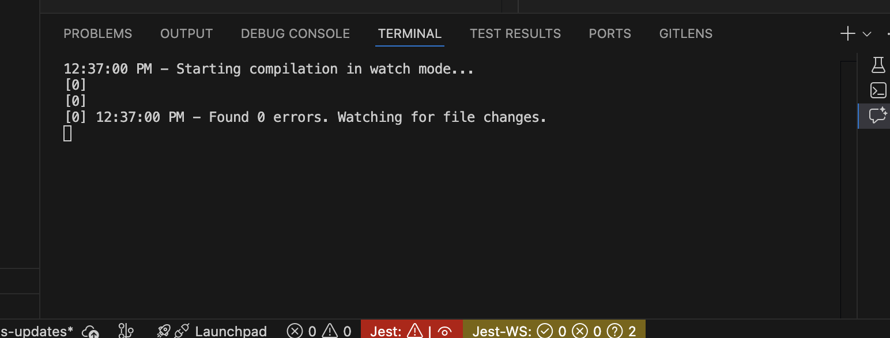

# First Time Setup
- Create a `.env` file and add the following variables:
```
BASE_URL=http://localhost:3366
ACCESS_TOKEN=asdf123
PORT=3366
NODE_ENV=local
```
- Run `npm install`
- Run `npm run dev`
- At this point you should see server output that looks like this: 

**You can now reach the server at localhost:3366**